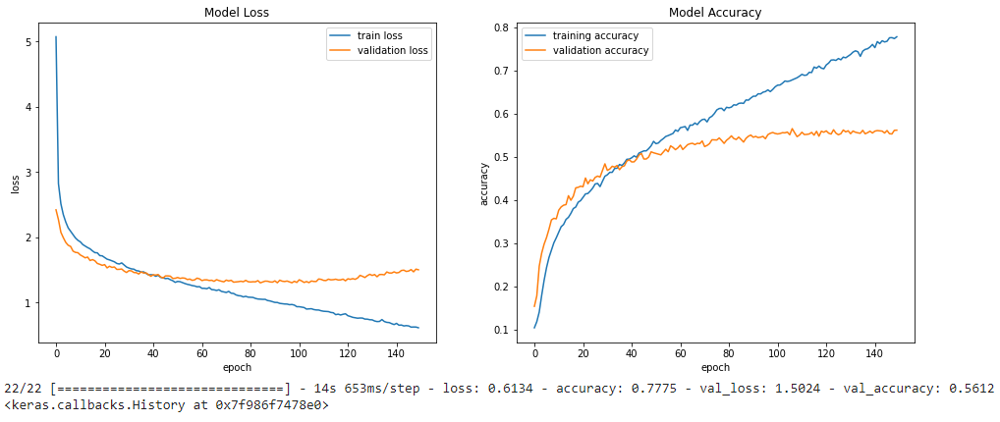
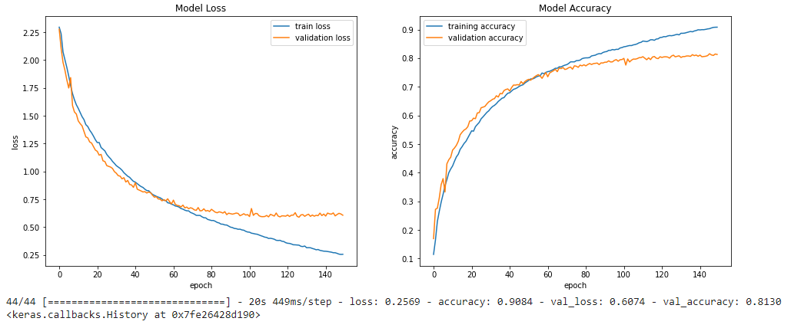

# Image-Classification-using-Neural-Network
Image Classification on CIFTAR-10 and MNIST Dataset using Dense and Convolution Neural Networks.

This code was developed for purely academic purposes by (ADG4050) as part of the module of Deep Learning and Applications (EE5C16) in Trinity College Dublin.

## Image Classification of CIFTAR - 10 using Dense Network
A Neural Network with 4 hidden dense layers of 800, 500, 300, 60 units each respectively were created along with Selu as activation function to test of Image Classification of the famous CIFTAR-10 Database. A training accuracy & test accuracy was obtained.

## Image Classification of MNIST Fashion Set using Dense Network
A Neural Network with 1 hidden dense layer of 128 units was created along with Relu as activation function to test of Image Classification of the famous MNIST Fashion Database. A training accuracy & test accuracy was obtained.

## Image Classification of CIFTAR - 10 Set using Convolutional Neural Network
A Neural Network with 3 CNN layers & 2 Dense Layers, with (3,3) kernel size and (2,2) maxpooling in each layer were created along with Relu as activation function to test of Image Classification of the CIFTAR Database. A training accuracy & test accuracy was obtained.

